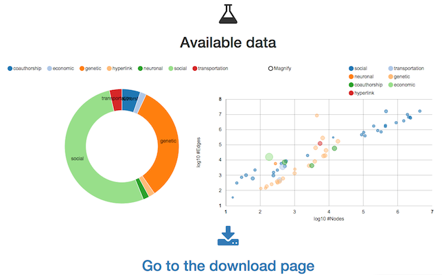

muxViz v3.0 (T'Challa)
=========

**IMPORTANT, README FIRST:**

* **v3.0** is the latest and continuously updated. It is not based on a GUI and allows to use muxViz fully from R scripts (with `igraph`and `ggplot2` packages, for instance)
* **v2.0** is the first version fully written in R. It will be updated sporadically. 
* **v1.0** is old and no more updated. This version is still based on Octave.

In case of anomalous/unexpected behavior, please report it to the dedicated [Google Group](https://groups.google.com/forum/#!forum/muxviz). Note that emails to personal address might remain unanswered. 
=======

<!-- README.md is generated from README.Rmd. Please edit that file -->

# muxViz v3.1: The R package 

<!-- badges: start -->

[](https://lifecycle.r-lib.org/articles/stages.html#experimental)
<!-- badges: end -->

## Installation

**v3.1** is the latest and is continuously updated. It is an R package
(still in development, not on CRAN) which can be installed in R by

``` r
devtools::install_github("manlius/muxViz")
```

<<<<<<< HEAD
### What is a multilayer network?

Multilayer networks are a class of models widely adopted to represent empirical complex system, including biomolecular networks (eg, interactomes, metabolomes), neuronal networks (eg, connectomes), information and communication networks, social/socio-technical/socio-ecological networks, economic and financial networks, urban and transportation networks.

You can read more on the dedicated [Wikipedia page](https://en.wikipedia.org/wiki/Multidimensional_network) or this [short illustrated summary](theory/multilayernets.md).

#### Official Websites and Social Networks

Please, note that the website (<http://muxviz.net>) of muxViz is no more the official one and will be dismissed soon. Refer to the Github repository for any official version. 

You might also want to take a look at muxViz in action: see the [Youtube channel](https://www.youtube.com/channel/UCinHX7m-8_EFFJo2A8huoUA)

Visit the dedicated [Google Group](https://groups.google.com/forum/#!forum/muxviz) if you have questions or to report bugs.

Instead, if you create amazing visualizations using muxViz and you want to tweet them, remember to include the "#muxviz" hashtag: we will be happy to retweet.

You might be interested in taking a look at the [official blog about muxViz](https://muxviz.wordpress.com), with posts about applications (analysis, visualization or both) to cool datasets.


#### Citation

If you use muxViz (or any part of muxViz, or images available in the gallery) for your multilayer analysis and visualization, you should cite the paper

Manlio De Domenico, Mason A. Porter, Alex Arenas, Multilayer Analysis and Visualization of Networks, published in [Journal of Complex Networks 3, 159-176 (2015)](http://comnet.oxfordjournals.org/content/3/2/159) (Open Access)

Manlio De Domenico, Multilayer Networks: Analysis and Visualization. Introduction to muxViz with R. To be published by Springer-Verlag (2021)

Please, note that muxViz is based on some algorithms developed in other studies. You should cite the original paper(s) every time that you use those algorithms. 

#### v3.0: The Standalone Library

The standalone library allows to use muxViz from R scripts without requiring to pass from any GUI, which is left for v2.0. If you want to use v3.0 you should:

* Download and install R. Note that the data analysis would benefit from the enhanced R environment developed by Microsoft: it is strongly recommended to download and install Microsoft R Open from

<https://mran.microsoft.com/download/>

* manually download muxViz or clone it:

		git clone https://github.com/manlius/muxViz

* download and install the required (or useful) dependencies with:

		for(pack in c("Matrix","RSpectra","tidyverse","GGally","compiler","ggraph","tictoc","rgl","igraph","RColorBrewer","viridis","corrplot")){
			install.packages(pack)
		}

* set the work directory to the `standalone` folder by

		setwd("/user/path/muxviz/standalone")

Then include the following header in your scripts:

	source("muxLib.R")

or directly source the library from your current working directory:

	source("/user/path/muxviz/standalone/muxLib.R")

To speed up your interaction with muxViz, the folder `standalone` contains some self-explanatory example scripts which show how to use the most salient analytical techniques available in the library:

* `community_detection.R`
* `connected_components.R`
* `example_coverage_optimized.R`
* `example_coverage.R`
* `example_overlapping_generator.R`
* `example_plot_edgecolored_heatmap_6panels.R`
* `example_plot_edgecolored_paths_coupling.R`
* `example_plot_edgecolored_paths.R`
* `example_plot_edgecolored.R`
* `example_transitivity_new.R`
* `layer-layer_corr.R`
* `multi_motifs.R`

Note that to work properly, you must (manually, for the moment) compile `fanmod` and `Infomap` on your system, and move the binaries in the `standalone folder`. 

If you are familiar with package creation and want to help to make this process smoother, you are more than welcome.

Typical outputs are:


Unfortunately, at this stage, documentation is still poor and requires some time.

#### v2.0: The Graphical User Interface


Note that linked data is in a different format and can not be used "as they are" by muxViz. A tool for easily convert from that format to muxViz is under development. 

A 10-minutes tutorial showing how easy is to work with muxViz is also available:
[](http://www.youtube.com/watch?v=gcpYSdi_-xI)

#### Plug & Play

A ready-to-use version of muxViz is available through [Docker](https://hub.docker.com/r/fkraeutli/muxviz-docker/).

##### Requirements and Installation

muxViz requires R v3.2.0 (or above). The data analysis would benefit from the enhanced R environment developed by Microsoft: it is strongly recommended to download and install Microsoft R Open from

<https://mran.microsoft.com/download/>

Otherwise, download and install a classical copy of R from

<http://www.r-project.org/>

Some external packages are required within the R environment. However, the main script should be able to detect the missing packages and install them, automatically. Therefore, it is likely that you *do not* need to install them by yourself.

You can download muxViz from Github: <https://github.com/manlius/muxViz/archive/master.zip>

To work properly with geographical networks, the GDAL (Geospatial Data Abstraction Library) is required and should be installed *before* running muxViz for the first time. GDAL should be available as an R package and should be easily installed just by typing

	install.packages("sp")
	install.packages("rgdal")

within the R environment. However, in a few cases it can be more complicated and some users reported problems for its installation. If this is also your case you might want to take a look at some suggestions on stackoverflow (<http://stackoverflow.com/questions/15248815/rgdal-package-installation>) or on spatial.ly (<http://spatial.ly/2010/11/installing-rgdal-on-mac-os-x/>). In any case, it is highly recommend to visit the GDAL website and follow the hints provided there (<http://trac.osgeo.org/gdal/wiki/BuildHints>).


###### Very quick installation on Linux

If you use a Linux (Ubuntu-like) distribution, you are very lucky, because the following BASH script will do the job for you:

    #download R from their repository
    wget http://cran.es.r-project.org/src/base/R-3/R-3.2.0.tar.gz
    DIR=$PWD
        
    #install R
    sudo apt-get build-dep r-base-core
    sudo mv R-3.2.0.tar.gz ~
    cd ~
    tar xvf R-3.2.0.tar.gz
    cd R-3.2.0
    ./configure
    make
    sudo make install
    
    #install GDAL
    sudo apt-get install libgdal1-dev libproj-dev

Finally, if your system has a working installation of R and GDAL, you can download the last version of muxViz, unzip it, go into the unzipped folder and type the following within R environment:

	source('muxVizGUI.R')

This should be enough. The script will check for the required packages and will try to automatically install the missing ones. The whole process might take a few minutes, the first time you run muxViz.

##### Troubleshooting

Please, if you have any problem during the installation of muxViz, visit the dedicated [Google Group](https://groups.google.com/forum/#!forum/muxviz) or check the TROUBLESHOOTING.md file before asking for help: you might find the solution faster.

If you find a smart solution to an installation/usage issue, feel free to send me an email and I will add your solution to the TROUBLESHOOTING.md file.


### Gallery

Here there are a few multilayer networks rendered by muxViz.


Please, also note that after a proper set up it is possible to use muxVizGUI also for the visualization (and basic analysis) of single-layer networks (equivalent to old monoxViz 0.1).
=======
## Backgroung
>>>>>>> dcd1fd32410789c4b15f9626a1cde482ca2e8395

The R package **muxViz** enables the visualization and the analysis of
interconnected multilayer networks. It supports the analysis of
multilayer data:

-   Multilayer correlation analysis
-   Multilayer centrality analysis and annular representation
-   Multilayer community structure detection
-   Multilayer structural reducibility
-   Multilayer motifs analysis
-   Animated visualization of dynamical processes and time-varying
    multilayer networks

muxViz supports the analysis and visualization of the following
multilayer networks: 

and the following layer layouts: 

### What is a multilayer network?

Multilayer networks are a class of models widely adopted to represent
empirical complex system, including biomolecular networks (eg,
interactomes, metabolomes), neuronal networks (eg, connectomes),
information and communication networks,
social/socio-technical/socio-ecological networks, economic and financial
networks, urban and transportation networks.

You can read more on the dedicated [Wikipedia
page](https://en.wikipedia.org/wiki/Multidimensional_network) or this
[short illustrated summary](theory/multilayernets.md).

#### Official Websites and Social Networks

Please, visit the official website (<http://muxviz.net>) of muxViz for
further information.

You might also want to take a look at muxViz in action: see the [Youtube
channel](https://www.youtube.com/channel/UCinHX7m-8_EFFJo2A8huoUA)

Visit the dedicated [Google
Group](https://groups.google.com/forum/#!forum/muxviz) if you have
questions or to report bugs.

Instead, if you create amazing visualizations using muxViz and you want
to tweet them, remember to include the “\#muxviz” hashtag: we will be
happy to retweet.

You might be interested in taking a look at the [official blog about
muxViz](https://muxviz.wordpress.com), with posts about applications
(analysis, visualization or both) to cool datasets.

## Documentation

Check the full package documentation (with usage tips and examples) at
[docs](https://manlius.github.io/muxViz/) .

## News

Check the [release news](./NEWS.md).

## Citation

If you use muxViz (or any part of muxViz, or images available in the
gallery) for your multilayer analysis and visualization, you should cite
the paper

Manlio De Domenico, Mason A. Porter, Alex Arenas, Multilayer Analysis
and Visualization of Networks, published in [Journal of Complex Networks
3, 159-176 (2015)](http://comnet.oxfordjournals.org/content/3/2/159)
(Open Access)

Please, note that muxViz is based on some algorithms developed in other
studies. You should cite the original paper(s) every time that you use
those algorithms.

## The Graphical User Interface

The previous implementation exploits a Graphical User Interface (working
with any browser) to provide access to many customizable graphic options
to render networks.




More details on the GUI (requirements, installation and usage) can be
found in the [GUI README](gui-old/gui-old/README.md).

## Copyright

##### (C) Copyright 2013-2021, Manlio De Domenico.

This code has no warranty whatsoever and any kind of support is
provided. You are free to do what you like with this code as long as you
leave this copyright in place. Please, explicitly cite muxViz if you
find it useful for your visualizations.

3.  Copyright 2013-2021, Manlio De Domenico (manlio.dedomenico at
    urv.cat)

Each file in this folder is part of the muxViz package, if not specified
otherwise by another license.

muxViz is free software: you can redistribute it and/or modify it under
the terms of the GNU General Public License as published by the Free
Software Foundation, either version 3 of the License, or (at your
option) any later version.

muxViz is distributed in the hope that it will be useful, but WITHOUT
ANY WARRANTY; without even the implied warranty of MERCHANTABILITY or
FITNESS FOR A PARTICULAR PURPOSE. See the GNU General Public License for
more details.

You should have received a copy of the GNU General Public License along
with the package. If not, see <http://www.gnu.org/licenses/>.

## Credits

This work has been partially supported by European Commission
FET-Proactive project PLEXMATH (Grant No. 317614)
(<http://www.plexmath.eu/>), the European project devoted to the
investigation of multi-level complex systems and has been developed at
the Alephsys Lab (<http://deim.urv.cat/~alephsys/>),

I am in debt with Alex Arenas for proposing this project, with Mason A.
Porter and the members of the Alephsys Lab for invaluable suggestions
and feedbacks.

I would like to thank Inderjit S. Jutla, Lucas G. S. Jeub, and Peter J.
Mucha for making their code about multislice community detection
available.

I would like to thank Martin Rosvall for allowing to distribute his C++
code for Multiplex Infomap under the AGPLv3 license.

I would also like to thank the following people for their unvaluable
(voluntary) support to muxViz and parts of its development:

-   Lucio Agostinho Rocha
-   Francesc Font
-   Patricia Gonçalves
-   Kim Klark
-   Sneha Rajen
-   Maria Pereda
-   Hiroki Sayama
-   Tzu-Chi Yen
-   Rafael Pereira
-   Yuriko Yamamoto
-   Rodrigo García
-   Sergio Alcalá-Corona
-   Guillermo de Anda Jáuregui
-   Giulia Bertagnolli

The development of muxViz has been funded, or is currently funded, by
the following entities and institutions:


## Donation

**muxViz** is a free and open-source platform that has been used for
scientific purposes in a variety of disciplines, including computational
social science, computational neuroscience, computational biology,
computational psycholinguistics, multi-modal transportation engineering
and physics.

Since January 2016, **muxViz** is periodically updated and maintained
for free by its developer and its enthusiastic community of users (the
*muxVizers*).

If **muxViz** helps you with your research and reduces your time to
develop, you can give us a cup of good coffee :)

**BTC**: 19RGUCZjSzvbjY5xEWz3GNg7MnMiPyEgbB

**ETH**: 0xe5027b44782a4b832a23773ffdb57658aff62e31

**XMR**:
49pQ1B2m2UHaKotqF8h1E89um9rnMPvAHEfGUET1icQUaxBV1KFhuTNVpsF6Kf4bf5dZwWvmdzYn4D7rKcL4v2ee3tH4E2L

**Paypal**:

[](https://www.paypal.com/cgi-bin/webscr?cmd=_donations&business=manlio.dedomenico@gmail.com&item_name=muxViz&item_number=muxViz+development&currency_code=USD)
