## Multilayer Networks Illustrated

**IMPORTANT**: The material shown in this page is subjected to copyright. [Click here](illustrations/LICENSE.md) for information. 

**How to cite**: *Figure from Manlio De Domenico, "Multilayer Networks Illustrated" (2020) DOI: 10.17605/OSF.IO/GY53K*

**Last update**: Sep 2020

Figure: schematic illustration of a multilayer model for multiscale analysis and visualization

## Fundamental models for empirical systems

Multilayer representation can be used to model a variety of empirical systems. In the following we show a few examples.

#### Visualization of multilayer networks: different approaches

#### Multiscale and multiplex model of a social system, from the molecular to the population layers

#### Multiplex model of a physical and virtual relationships in a social system

#### Multiscale and multiplex model of a physical transportation system

#### Multiscale and multiplex model of an ecological system

## The math of multilayer networks

#### Distinct classes of multilayer models: non-interconnected vs interconnected

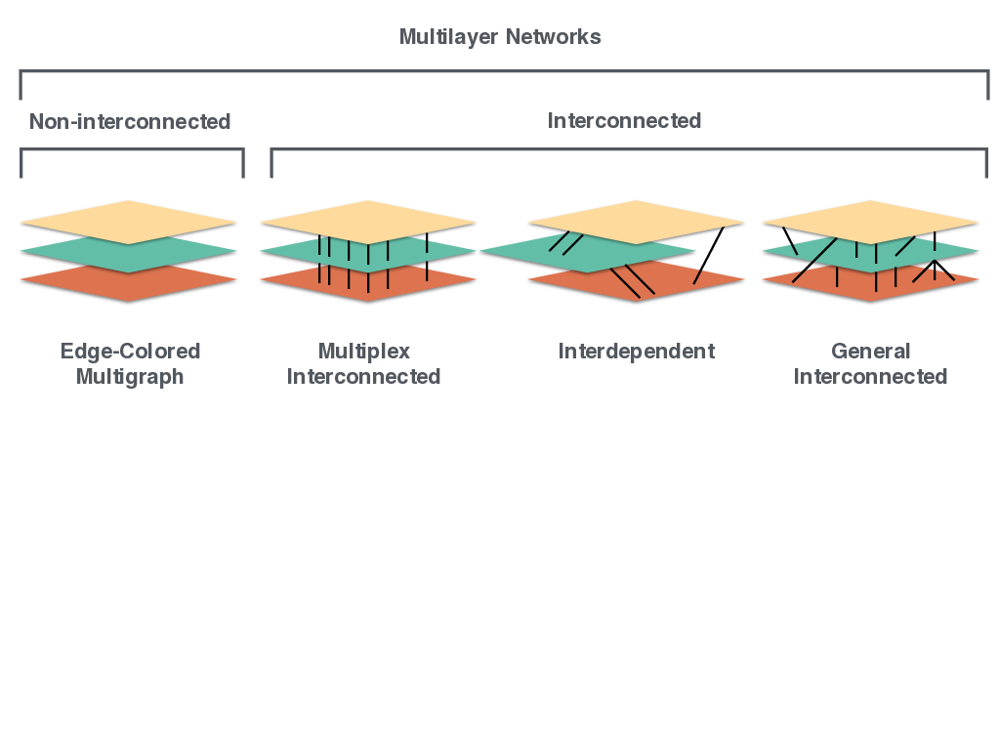

#### The basic ingredients of a multilayer network are: state nodes, physical nodes, layers and interactions

#### The mathematical representation of complex objects can be understood in terms of tensors of different rank

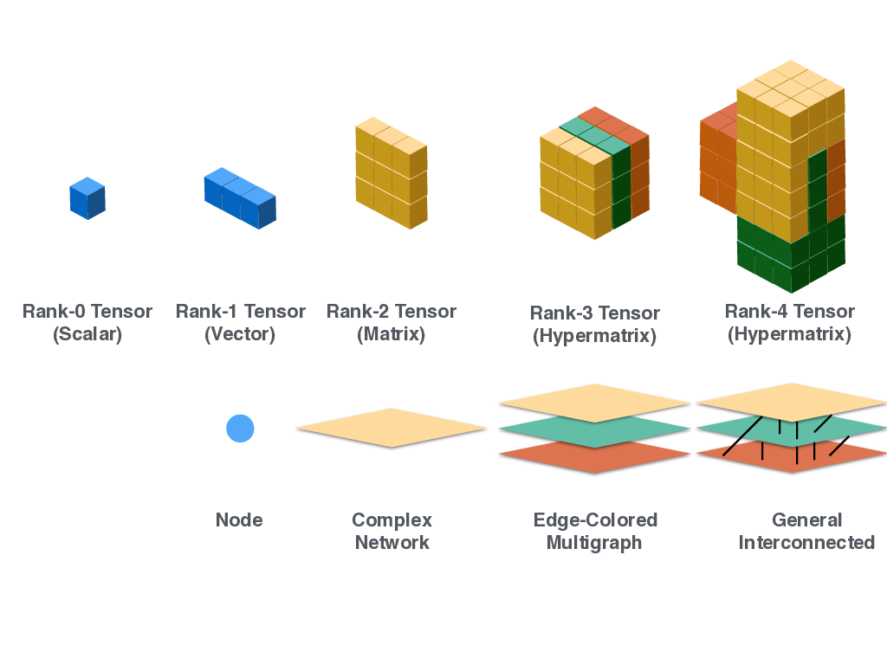

#### Operatively, rank-4 tensors can be mapped into rank-2 supra-adjacency matrices to facilitate operations (with care)

### This is achieved by means of matricization/flattening

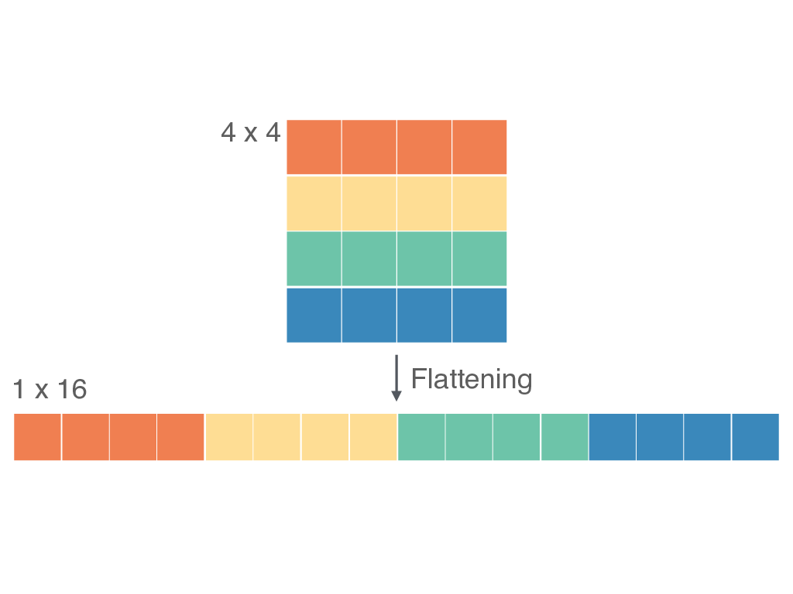

#### Macroscopically, multilayer networks can be characterized also by the way its layers are interdependent with each other

#### In some cases, a poor representation of a multilayer network can be its aggregate



#### Dynamics on the top of multilayer networks (single vs coupled)



#### Dynamics on the top of multilayer networks (Random walk)


#### Dynamics of multilayer networks (classical vs multilayer)


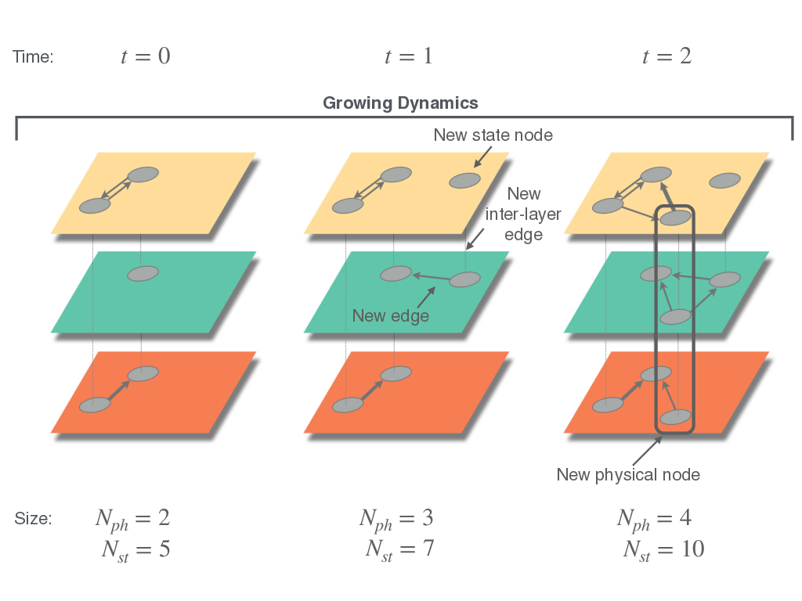
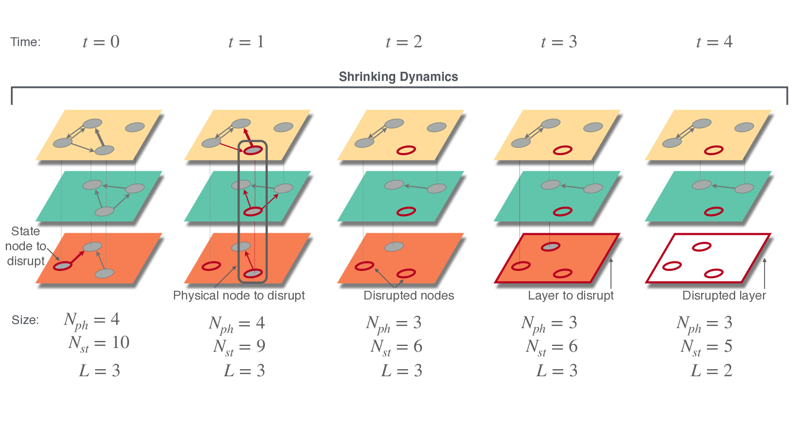

#### Structural analysis of multilayer networks: paths



#### Structural analysis of multilayer networks: connected components

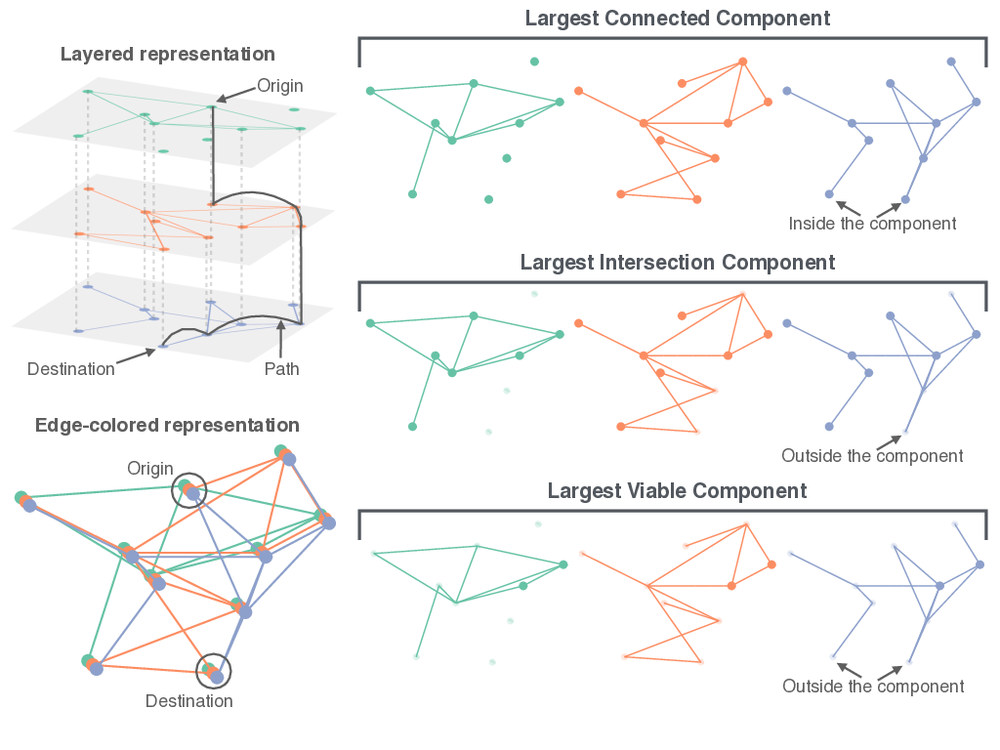

#### Structural analysis of multilayer networks: centrality/versatility



#### Structural analysis of multilayer networks: motifs and triadic closure

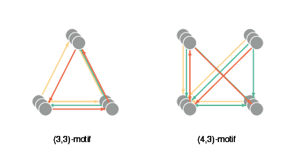
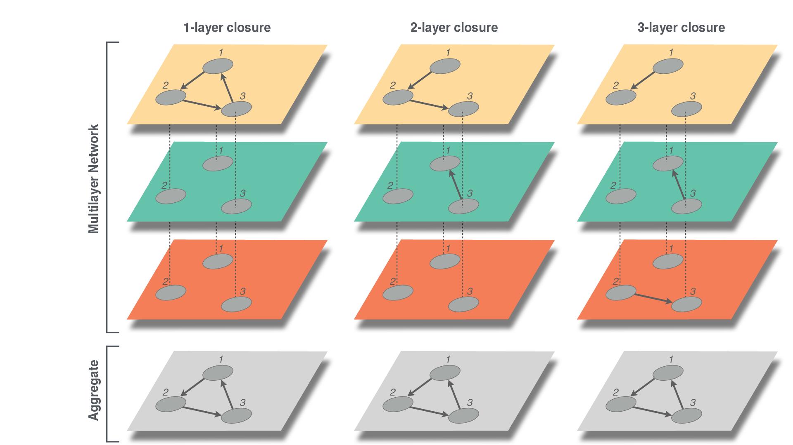

#### Structural analysis of multilayer networks: dimensionality reduction

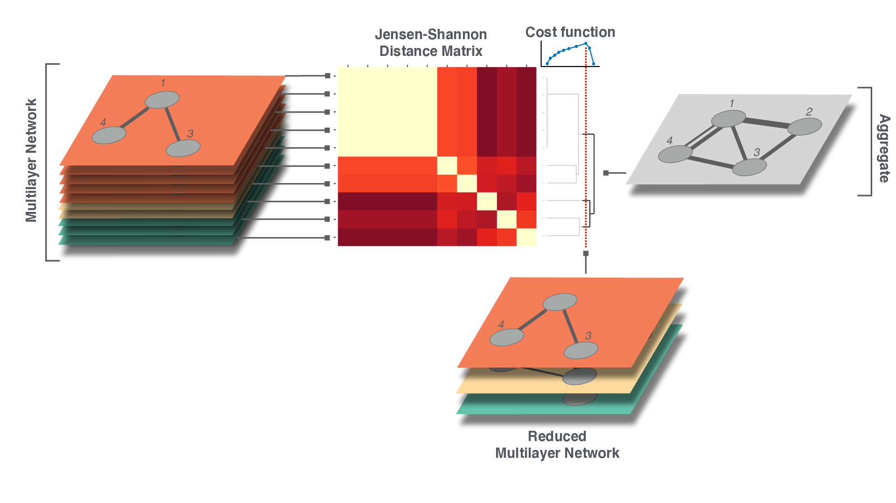


#### Empirical systems: coauthorship network of physicists

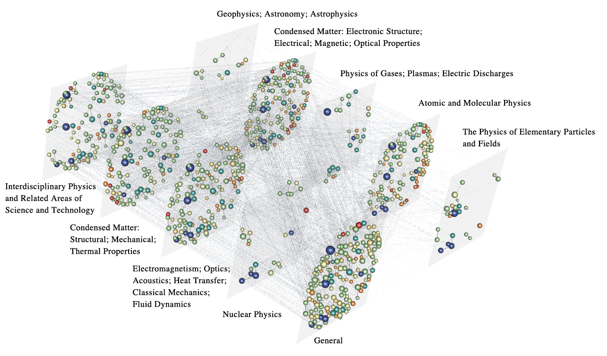

#### Empirical systems: Game of thrones saga

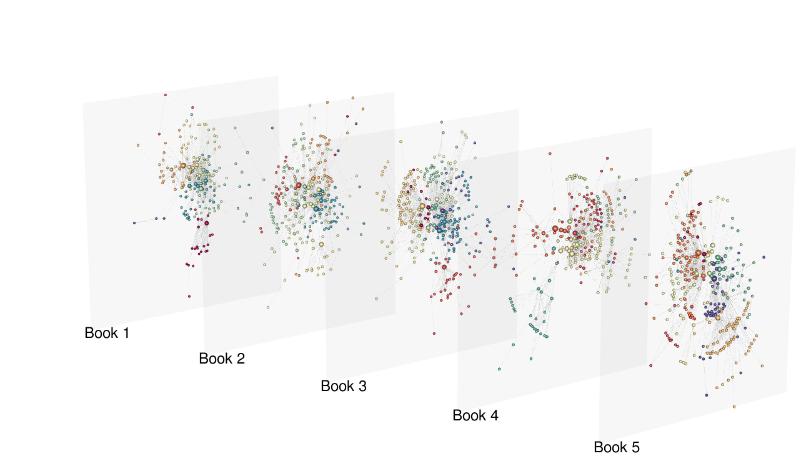


#### Empirical systems: Star wars saga











