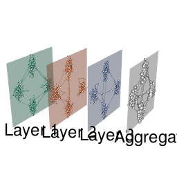
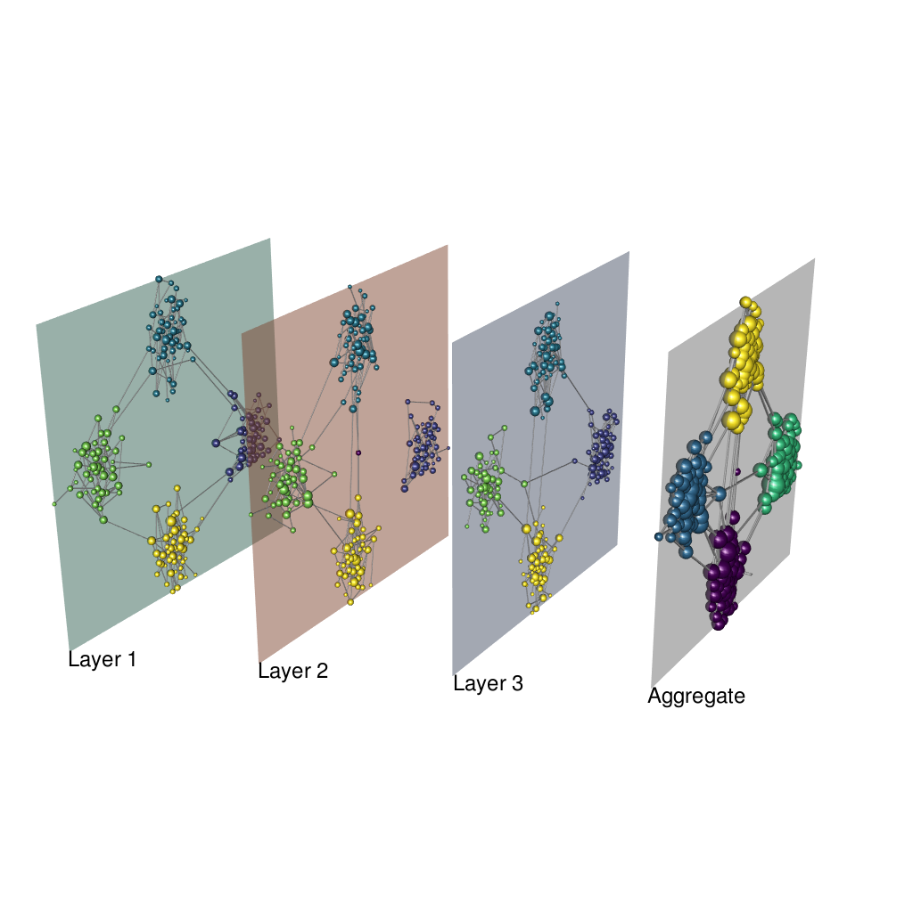

```{r, include = FALSE}
knitr::opts_chunk$set(
  collapse = TRUE,
  comment = "#>",
  fig.path = "../man/figures/"
)
```


```{r load-libs}
library(muxViz)
library(igraph)
library(RColorBrewer)
library(viridis)
library(rgl)
```

```{r setup}
set.seed(1)
# Network setup
Layers <- 3
Nodes <- 200
layerCouplingStrength <- 1
networkOfLayersType <- "categorical"
isDirected <- F
layer.colors <- brewer.pal(8, "Set2")
```

Setup Infomap, see [setup Infomap vignette](./setup_infomap_fanmod.html)

```{r infomap-setup}
pathInfomap <- "../src-exe/infomap-0.x/Infomap"
```

## Multiplex modules

Generate an edge-colored network and layers with 4 modules

```{r}
nodeTensor <- list()
g.list <- list()
plantedGroupsPerLayer <- 4
# matrix of the stochastic block model
block.matrix <- matrix(0.1 / Nodes, plantedGroupsPerLayer,
                       plantedGroupsPerLayer)
diag(block.matrix) <- 2 * log(Nodes) / Nodes
block.sizes <- rep(floor(Nodes / plantedGroupsPerLayer), plantedGroupsPerLayer)

for (l in 1:Layers) {
    #Generate the layers
    g.list[[l]] <- sample_sbm(Nodes, pref.matrix=block.matrix,
      block.sizes=block.sizes)

    #Get the list of adjacency matrices which build the multiplex
    nodeTensor[[l]] <- get.adjacency(g.list[[l]])
}
```

Calculate a layout for consistent visualizations

```{r plot}
lay <- layoutMultiplex(g.list, layout="fr", ggplot.format=F, box=T)

# Show the multiplex network
plot_multiplex3D(g.list, layer.layout=lay, layer.colors=layer.colors,
                         layer.shift.x=0.5, layer.space=2,
                         layer.labels="auto", layer.labels.cex=1.5,
                         node.size.values="auto", node.size.scale=0.8,
                         show.aggregate=T)
# save the plot:
snapshot3d("../man/figures/multi_sbm.png", fmt = "png", width = 1024, height = 1024)
```

```{r echo=FALSE} 

```

Find modules without imposing hard partitions

```{r modules}
commResult <- GetMultiplexCommunities_Infomap(g.list,
                                              bin.path=pathInfomap,
                                              isDirected=isDirected,
                                              seed=12345,
                                              includeSelfLinks=F,
                                              numTrials=100,
                                              twoLevel=T,
                                              preclusterMultiplex=F,
                                              addMissingPhysicalNodes=F,
                                              hardPartitions=F,
                                              verbose=T,
                                              addAggregateAnalysis=T,
                                              multilayerRelaxRate=0.5,
                                              multilayerJSRelaxRate=NA,
                                              outputPrefix="multimap_example")
```

Find modules by imposing hard partitions

```{r modules-hard}
commResult.hp <- GetMultiplexCommunities_Infomap(g.list,
                                              bin.path=pathInfomap,
                                              isDirected=isDirected,
                                              seed=12345,
                                              includeSelfLinks=F,
                                              numTrials=100,
                                              twoLevel=T,
                                              preclusterMultiplex=F,
                                              addMissingPhysicalNodes=F,
                                              hardPartitions=T,
                                              verbose=T,
                                              addAggregateAnalysis=T,
                                              multilayerRelaxRate=0.5,
                                              multilayerJSRelaxRate=NA,
                                              outputPrefix="multimap_example_hp")
```

Finally, process the results:

1. Multilayer: module size distribution (no hard partitions): `r commResult$msize.multi`
2. Multilayer: module size distribution (with hard partitions): `r commResult.hp$msize.multi`
3. Aggregate: module size distribution `r commResult$msize.aggr`

##### Compare the results without and with hard partitions.

Quantify difference between hard/non-hard partitions

```{r comparison}
VI <- igraph::compare(commResult$membership.multi$module, commResult.hp$membership.multi$module, method="vi")
NMI <- igraph::compare(commResult$membership.multi$module, commResult.hp$membership.multi$module, method="nmi")
ARI <- igraph::compare(commResult$membership.multi$module, commResult.hp$membership.multi$module, method="adjusted.rand")
```

* Variation of Information: `r VI` bits
* Normalized Mutual Information: `r NMI`
* Adjusted Rand Index: `r ARI`

#### Plots

```{r ml-modules-plots}
# make palettes according to identified modules
pal.mux <- sample(viridis(commResult$modules.multi))
pal.aggr <- sample(viridis(commResult$modules.aggr))

png("../man/figures/multi_sbm_infomap_table.png", width = 1024, height = 728 / 2,
    res = 100)
gplt <- plot_multimodules(commResult, module.colors = pal.mux,
                          show.aggregate = T)
dev.off()

png("../man/figures/multi_sbm_infomap_hp_table.png", width = 1024,
    height = 728 / 2, res = 100)
gplt.hp <- plot_multimodules(commResult.hp, module.colors = pal.mux,
                             show.aggregate = T)
dev.off()
```

```{r echo=FALSE} 
knitr::include_graphics("../man/figures/multi_sbm_infomap_table.png")
knitr::include_graphics("../man/figures/multi_sbm_infomap_hp_table.png")
```

Case with inter-layer connections and no hard partitions

```{r plot-no-hard}
# coloring state nodes
node.colors.matrix <- matrix("#dadada", Nodes, Layers)
for (l in 1:Layers) {
    dftmp <- commResult$membership.multi[commResult$membership.multi$layer==l,]
    idxs <- dftmp$node
    node.colors.matrix[idxs,l] <- pal.mux[dftmp$module]
}

# coloring physical nodes in the aggregate
node.colors.aggr <- rep("#dadada", Nodes)
node.colors.aggr[commResult$membership.aggr$node] <- pal.aggr[commResult$membership.aggr$module]

plot_multiplex3D(g.list, layer.layout=lay, layer.colors=layer.colors,
                         layer.shift.x=0.5, layer.space=2,
                         layer.labels="auto", layer.labels.cex=1.5,
                         node.size.values="auto", node.size.scale=0.8,
                         node.colors=node.colors.matrix, edge.colors="#dadada",
                         node.colors.aggr=node.colors.aggr,
                         show.aggregate=T)
snapshot3d("man/figures/multi_sbm_infomap.png", fmt = "png", width = 1024, height = 1024)
```

Case with hard partitions

```{r}
# coloring state nodes
node.colors.matrix <- matrix("#dadada", Nodes, Layers)
for (l in 1:Layers) {
    dftmp <- commResult.hp$membership.multi[commResult.hp$membership.multi$layer==l,]
    idxs <- dftmp$node
    node.colors.matrix[idxs,l] <- pal.mux[dftmp$module]
}

# coloring physical nodes in the aggregate
node.colors.aggr <- rep("#dadada", Nodes)
node.colors.aggr[commResult.hp$membership.aggr$node] <- pal.aggr[commResult.hp$membership.aggr$module]

plot_multiplex3D(g.list, layer.layout=lay, layer.colors=layer.colors,
                         layer.shift.x=0.5, layer.space=2,
                         layer.labels="auto", layer.labels.cex=1.5,
                         node.size.values="auto", node.size.scale=0.8,
                         node.colors=node.colors.matrix, edge.colors="#dadada",
                         node.colors.aggr=node.colors.aggr,
                         show.aggregate=T)
snapshot3d("../man/figures/multi_sbm_infomap_hp.png", fmt="png", width = 1024, height = 1024)
```

```{r, echo=FALSE}
knitr::include_graphics("../man/figures/multi_sbm_infomap_hp.png")
```


## Multilayer modules

```{r}
# Define the network of layers
layerTensor <- BuildLayersTensor(Layers=Layers, OmegaParameter=layerCouplingStrength,
                                 MultisliceType=networkOfLayersType)
layerLabels <- 1:Layers

# Build the multilayer adjacency tensor
M <- BuildSupraAdjacencyMatrixFromEdgeColoredMatrices(nodeTensor, layerTensor, Layers, Nodes)

commResult2 <-
  GetMultilayerCommunities_Infomap(
    SupraAdjacencyMatrix = M,
    Layers = Layers,
    Nodes = Nodes,
    bin.path = pathInfomap,
    isDirected = isDirected,
    seed = 12345,
    includeSelfLinks = F,
    numTrials = 100,
    twoLevel = T,
    preclusterMultiplex = F,
    addMissingPhysicalNodes = F,
    hardPartitions = F,
    verbose = T,
    addAggregateAnalysis = T,
    outputPrefix = "multimap_example2"
  )

```

Case with inter-layer connections and no hard partitions

```{r}
# coloring state nodes
node.colors.matrix2 <- matrix("#dadada", Nodes, Layers)
for(l in 1:Layers){
    dftmp <- commResult2$membership.multi[commResult2$membership.multi$layer==l,]
    idxs <- dftmp$node
    node.colors.matrix2[idxs,l] <- pal.mux[dftmp$module]
}

# coloring physical nodes in the aggregate
node.colors.aggr2 <- rep("#dadada", Nodes)
node.colors.aggr2[commResult2$membership.aggr$node] <- pal.aggr[commResult2$membership.aggr$module]

plot_multiplex3D(g.list, layer.layout=lay, layer.colors=layer.colors,
                         layer.shift.x=0.5, layer.space=2,
                         layer.labels="auto", layer.labels.cex=1.5,
                         node.size.values="auto", node.size.scale=0.8,
                         node.colors=node.colors.matrix2, edge.colors="#dadada",
                         node.colors.aggr=node.colors.aggr2,
                         show.aggregate=T)
snapshot3d("../man/figures/multi_sbm_infomap2.png", fmt="png", width = 1024, height = 1024)
```

```{r, echo=FALSE}

```

Look at the size of all communities:

* Multilayer: module size distribution (no hard partitions) `r commResult2$msize.multi`
* Aggregate: module size distribution `r commResult2$msize.aggr`
